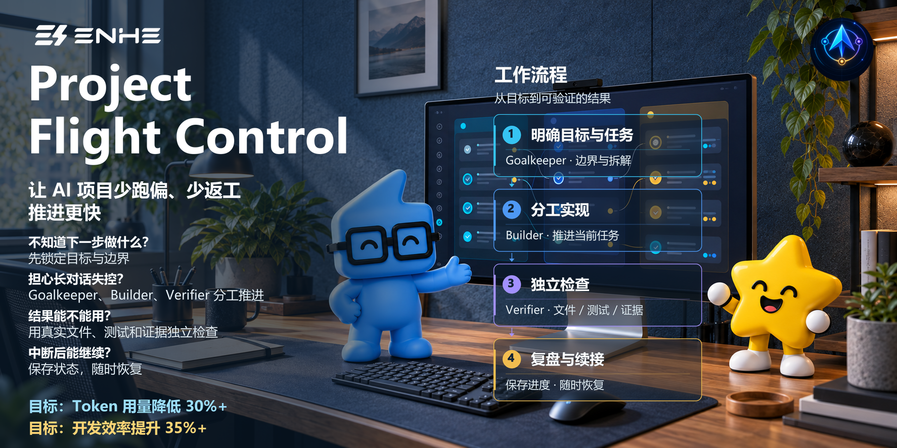

# Project Flight Control

[简体中文](README.md) | [English](README.en.md)

让 AI 做复杂项目时，有人负责把方向说清楚，有人负责动手，还有人负责检查结果。

> 当前版本：`0.1.0-dev.0`。

## 一、这个仓库是什么？

Project Flight Control 是一个给 Codex 使用的项目管理 Skill。

当任务比较长、需要修改很多文件，或者要分几次完成时，它会把工作分给三个角色：

- **Goalkeeper（目标管家）**：确认目标、范围和完成标准，记录进度并决定下一步。
- **Builder（执行者）**：按照已经确认的任务动手实现，并提交过程证据。
- **Verifier（检查者）**：在独立环境中检查结果，找出遗漏、错误和风险。

它不是新的 AI 模型，也不是一句“万能提示词”。它更像是一套工作秩序，让 AI 在做复杂项目时少跑偏、能复查、能继续。

## 二、适合谁用？

### 1、特别适合

- 正在用 Codex 做网站、工具、自动化流程或个人产品的人。
- 不会写很多代码，但希望 AI 能把事情做得更有条理的人。
- 任务需要跨多个对话、多个阶段持续推进的人。
- 担心 AI 改错文件、漏掉测试，或者“说做完了但其实没做完”的人。
- 一人公司、独立开发者、产品设计师和 AI Builder。
- 希望每一步都有检查结果、失败原因和下一步建议的人。

### 2、不适合

- 只想问一个简单问题、改一句文案或做一次小修改。
- 希望 AI 完全无人看管地修改生产环境、发布产品或处理敏感数据。
- 需要把当前 Windows 沙箱当作严格保密边界的项目。
- 不使用 Codex，或当前环境不支持本项目所需 Skill 和角色配置。

## 三、它会产出什么？

使用后，你通常会得到：

- 一份清楚的目标、范围和完成标准。
- 分阶段的任务安排和当前进度。
- Builder 完成的代码或文件修改。
- Verifier 给出的独立检查结果。
- 每个阶段的测试、证据和风险说明。
- 一份最终回执：做了什么、哪些通过、哪里仍有问题、下一步是什么。

## 四、具有什么价值？

### 让任务不容易跑偏

先把目标和边界说清楚，再开始动手。中途想改方向时，也会先记录变化。

### 让“完成”有依据

Builder 负责实现，Verifier 负责检查。是否完成要看真实文件、测试和检查结果，不只听 AI 自己总结。

### 让长任务可以继续

项目状态会保存在 Git 和项目记录中。换一个对话、暂停几天或中途恢复时，可以从真实状态继续。

### 让失败更容易处理

遇到错误时会记录失败原因、受影响范围和下一步，不会把没有验证的内容写成“已通过”。

### 帮助压缩 Token 使用量和项目开发时间

Builder 已配置按需读取上下文、优先复用已有能力、只做必要修改、按风险分层验证，以及针对失败项和受影响部分返工的机制。这些机制通过减少重复读取、重复实现和无必要的返工，帮助压缩 Token 使用量和项目开发时间，同时保留必需的质量与安全验证。

### 按需 Specialist 专项审查

项目已具备按需 Specialist 专项审查机制。遇到需要专业判断的问题时，Goalkeeper 可以围绕一个专项问题，绑定固定的代码与证据版本，在独立临时工作区中安排审查。Specialist 提供证据和意见，必要时可补充一次证据，由 Goalkeeper 处理最终决定。

该机制依赖运行环境提供独立代理和独立工作区。Specialist 是按次启用的临时专家，不是永久的第四个角色。具体边界见 [Specialist 协议](skill/project-flight-control/references/specialist-protocol.md)。

## 五、示例效果

例如，你想让 Codex 完成一个包含页面、数据保存和测试的小产品。

普通方式可能是：

```text
帮我把这个功能做完。
```

使用 Project Flight Control 后，可以这样开始：

```text
$project-flight-control

MODE: START
目标：为当前项目增加用户资料页面，并保存用户填写的信息。
约束：不修改生产环境，不执行发布。
完成标准：页面可以正常使用，数据可以保存，相关测试通过，并完成独立检查。
```

之后的工作会按照“确认目标 → 实现 → 独立检查 → 修正或验收”的顺序推进。最后你会看到类似这样的结果：

```text
当前状态：PARTIAL
已经完成：资料页面和数据保存
检查结果：页面测试通过，权限检查仍需处理
阻塞项：缺少测试环境配置
下一步：补齐配置后重新检查权限
```

### Token 与时间如何估算

以下只演示一种**假设情景估算，非实测**：比较同一工作量、同一质量与验证标准下的流程。这是重复工作占比较高的目标情景；为展示 Token 约压缩 30%、开发时间约压缩 35% 这两个目标所需的条件而设置假设，不是对项目实际效果的预测。Token 统计包含 Goalkeeper、Builder、Verifier，以及启用时的 Specialist 等所有角色的输入和输出总量。

- **Token：假设情景估算，非实测。** 基准为 100,000 总 Token；假设其中 70% 属于可重复工作，而一半可避免，另增加 5,000 Token 的三角色协调开销。则为 `100,000 − 100,000 × 70% × 50% + 5,000 = 70,000 Token`，约压缩 **30%**。
- **开发时间：假设情景估算，非实测。** 基准为 10 小时；假设其中 80% 是重复工作，而一半可避免，另增加 0.5 小时的协调与审查。则为 `10 − 10 × 80% × 50% + 0.5 = 6.5 小时`，约压缩 **35%**。

这些数字仅用于说明计算方法，不是产品平均表现、典型效果或效果保证。实际结果取决于任务、上下文和返工情况；所有角色的额外开销都应计入，可能抵消甚至逆转收益。

## 六、安装方法

使用前请准备 Windows 10/11、Windows PowerShell 5.1、Git for Windows，以及支持 Skill 和独立代理的 Codex 本地运行环境。所选模型的访问权限和可用额度，请按自己的 Codex 账号确认。

### 方法一：使用 Git 下载

在 Windows PowerShell 中运行：

```powershell
git clone https://github.com/yangjing6213-dev/codex-project-flight-control-Agents-Token-.git
cd codex-project-flight-control-Agents-Token-
powershell.exe -NoProfile -ExecutionPolicy Bypass -File .\scripts\install.ps1 -Json
```

### 方法二：直接下载 ZIP

1. 打开本仓库，点击 **Code → Download ZIP**。
2. 解压 ZIP，并在解压后的目录中打开 PowerShell。
3. 运行：

```powershell
powershell.exe -NoProfile -ExecutionPolicy Bypass -File .\scripts\install.ps1 -Json
```

安装后重新打开 Codex，或者新建一个 Codex 任务。可以运行下面的命令检查安装状态：

```powershell
powershell.exe -NoProfile -ExecutionPolicy Bypass -File .\scripts\doctor.ps1 -Json
```

如果安装器提示已有文件冲突，请先保留原文件，把完整输出交给 Codex 检查，不要直接删除或覆盖。

## 七、如何使用

这个 Skill 只支持显式调用。请在 Codex 消息的第一行输入：

```text
$project-flight-control
```

推荐按以下格式使用：

```text
$project-flight-control

MODE: START
目标：为当前仓库实现用户登录功能。
约束：不修改生产环境，不执行 Push。
完成标准：实现、测试、独立审查全部通过。
```

它支持四种模式：

- `START`：开始一个新的复杂任务。
- `RESUME`：从已有 Git 和项目记录继续工作。
- `AUDIT`：检查现有实现、结果或发布状态。
- `STATUS_ONLY`：只查看进度，不修改文件。

继续已有任务：

```text
$project-flight-control

MODE: RESUME
请从现有 Git 和项目记录恢复，继续完成剩余任务。
```

只做检查：

```text
$project-flight-control

MODE: AUDIT
检查当前实现是否符合设计、测试和安全要求，不修改代码。
```

只看进度：

```text
$project-flight-control

MODE: STATUS_ONLY
读取当前项目状态，汇报已完成任务、阻塞项和下一步。
```

## 八、项目工作流程

1. **你提出目标**：说明想做什么，以及不能做什么。
2. **Goalkeeper 整理任务**：确认范围、完成标准、当前项目状态和风险。
3. **Builder 开始实现**：只处理已经确认的工作，并运行相关检查。
4. **Verifier 独立检查**：检查结果是否符合目标，测试是否可信，有没有遗漏。
5. **Goalkeeper 给出决定**：通过、返工、暂停或等待你决定，并留下清楚的项目回执。

每个阶段默认都会停在清楚的检查点。未通过的结果不会直接成为下一阶段的基础。

## 九、项目目录结构

```text
├─ skill/project-flight-control/   Skill 主文件、规则和报告模板
├─ codex-agents/                   Builder 与 Verifier 配置
├─ scripts/                        安装、更新、卸载和状态检查脚本
├─ evals/                          测试、检查工具和评估场景
├─ docs/                           设计、计划、验证报告和已知风险
├─ assets/                         README 使用的图片
├─ VERSION                         当前版本号
└─ LICENSE                         MIT 开源许可证
```

## 十、注意事项

- 必须输入 `$project-flight-control` 才会启用，普通对话不会自动触发。
- 当前版本的正式发布验证尚未完成，尚未达到稳定发布标准。
- Windows 环境中的严格读取隔离目前没有得到可靠验证。不要把密码、密钥、客户资料或其他敏感文件交给这个流程保护。
- Builder Efficiency 已完成确定性检查，真实模型对比评估尚未完成；上面的假设情景估算不能作为实测结论。
- Skill 会使用 Git、提交和独立工作区来保存进度。请先备份重要项目，并在执行 Push、发布或生产环境操作前认真查看授权内容。
- AI 的检查结果仍需要你最终判断，尤其是涉及账号、费用、权限、隐私和线上业务时。
- 本项目采用 [MIT License](LICENSE)。你可以使用、修改和分享代码，但需要保留原有的版权和许可证说明。

## 十一、相关项目

无。

## 十二、关于作者


### Enhe（恩禾）

产品设计师 · 一人公司实践者 · AI Builder

**用 AI 打造一个人公司。**

- GitHub：[yangjing6213-dev](https://github.com/yangjing6213-dev)
- X / Twitter：[@Amenenhe_ai](https://x.com/Amenenhe_ai)
- 网站：[www.enhe-tech.com.cn](https://www.enhe-tech.com.cn/)
- 微信：`Hu-Amen`
- 邮箱：**amen.enhe@gmail.com**

[恩禾 ENHE AI｜AI 工具、AI 资讯、账号服务与技能课程](https://www.enhe-tech.com.cn/)

## 十三、继续探索

这个项目是我用 AI 搭建的个人生成系统里的一个工具。如果你也在用 AI 做内容、知识库、工作流或者产品化，可以登录我的网站 [www.enhe-tech.com.cn](https://www.enhe-tech.com.cn/) 查看更多资料。
